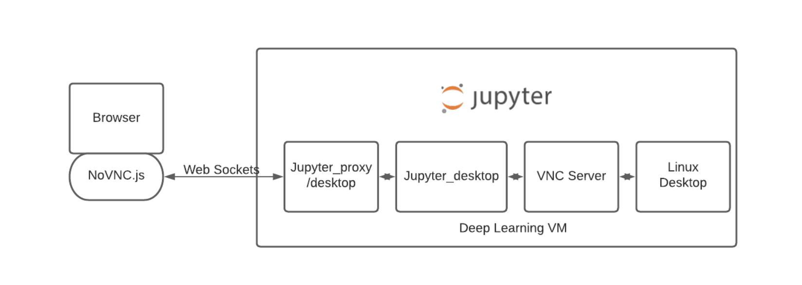
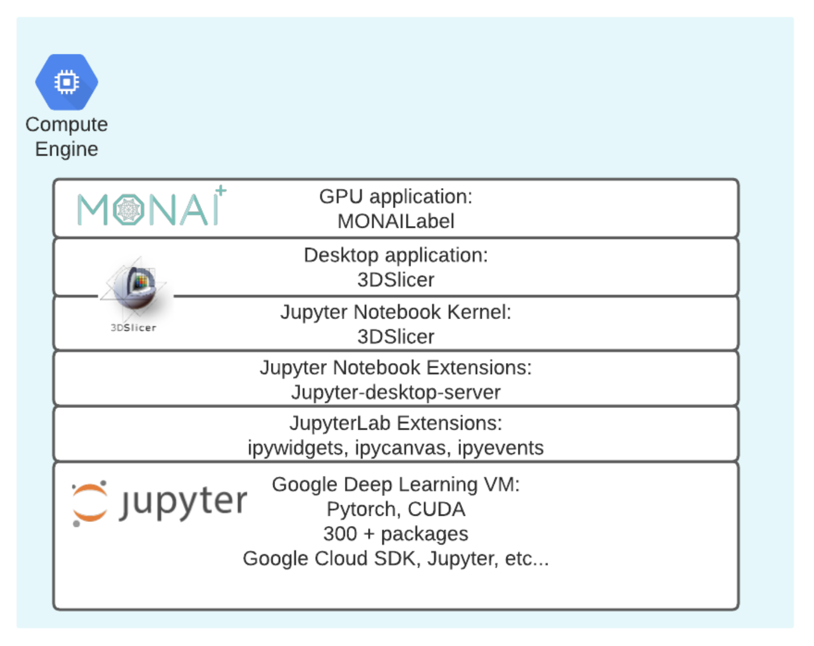

# Google Cloud Medical Imaging Lab

**If you know why you are here and you are in a hurry to deploy:**
There are only a few things that you need to know:
1)  The licensing terms in this repository cover only the installation scripts themselves, however the installation scripts will pull several packages from other open source repositories which may have different licensing terms (read the description below for a list of external packages).
2)  The scripts in this repository are designed to be applied to a new instance of the Google Cloud Vertex AI Workbench and may not work if applied to a previously modified instance.
3)  Creating a new Google Cloud Vertex AI Workbench instance generates costs in your Google Cloud project. A per minute cost estimate is provided in the instance creation dialog. While the scripts in this repo are provided free of charge, the user is responsible for the costs of running the underlying Google Cloud Vertex AI Workbench instance. Some of the labs proposed in this repo benefit from GPU acceleration, the user should understand that adding GPU resources increases the cost of the underlying VM. The user should stop or suspend the Cloud Vertex AI Workbench instance when not in use, and completely delete it when no longer needed in order to avoid charges to the user's Cloud project.

**To deploy the Google Cloud Medical Imaging Lab:**
follow the directions here: https://github.com/novmarcos/medical-image-lab/blob/main/instructions/en.md

# Project Description
This Google Cloud Medical Imaging Lab is an open source extension which adds medical imaging processing capabilities to the base Jupyter environment of the Google Cloud Vertex AI Workbench.  The following are the main packages that are fetched during the installation process:
- Jupyter Desktop Server and its dependencies (including TurboVNC, noVNC and jupyter-proxy): https://github.com/yuvipanda/jupyter-desktop-server
- The NIH 3DSlicer application: https://www.slicer.org/
- The MONAI project's MONAILabel application: https://github.com/Project-MONAI/MONAILabel

# Architecture**
The NIH 3DSlicer application is a popular application for working with medical images. This application is able to render large three dimensional images, such as complete CT scans, MRIs and so forth. Due to its advanced graphical capabilites, the 3DSlicer requires a graphical desktop such as X-windows, which makes its deployment in a hosted Cloud Environment difficult. The Slicer Jupyter project (https://github.com/Slicer/SlicerJupyter) provides an elegant solution to this problem by leveraging several open source components which basically achieve the magic of tunneling a desktop protocol (TurboVNC) through the JupyerLab server process. This solution provides secure access such that a Cloud user can access both the JupyterLab application (Notebooks) as well as the X-windows desktop of the VM that is hosting JupyterLab. The overall achitecture of this solution is illustrated below:

The SlicerJupyter Solution is packaged with its own Jupyter environment, but it is also capable of running with an external JupyterLab server. This project has taken the latter approach, it deploys the 3DSlicer Jupyer Kernel on top of the base Google Cloud Vertex AI Workbench JupyterLab Server. The avantage of this approach is that the Vertex AI distribution of Jupyter contains all the most popular AI packages enabled with the latest CUDA drivers. This feature assures the compatility with the other imaging AI packages that are installed, such as the MONAILabel server. The picture below illustrates the several package layers that are part of this installation:

