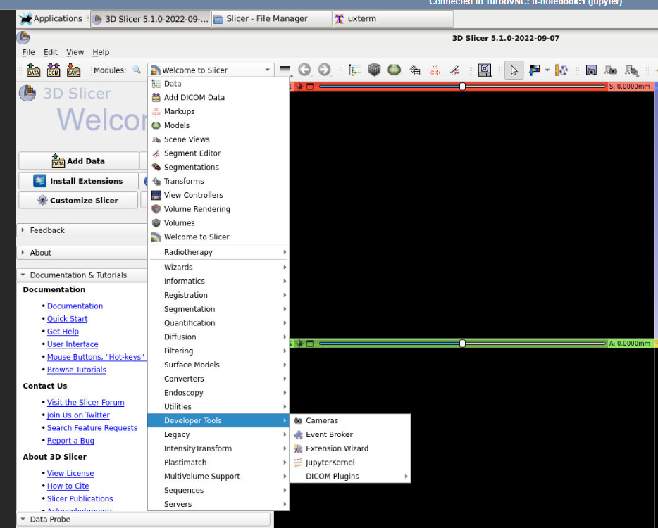
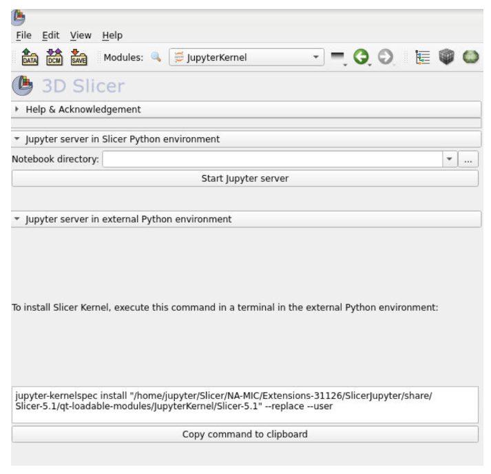
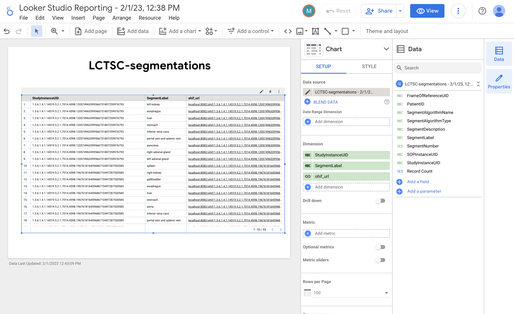

# Medical Imaging Suite

## Notice ##
When you start the lab for the first time, it will give you an option to create a browser profile for the gitlab user ID.
Click "OK" to have the profile created and make sure you are using the github user profile to access the Cloud Console and Jupyter lab.
If you missed that step, you can create the profile manually in Chrome using the menu option **Profiles** > **Add Profile**
Provide the quicklab ID and password to create the profile
Using the quicklab profile you can access the Google Cloud Console navigating to:
https://https://console.cloud.google.com/

## Overview

*Duration is 6 hrs*

### __Learning Objectives__

In this lab, you will:

* Create an instance of the Google Cloud Medical Imaging Lab
* Understand how to use the Medical Image Datasets provided by the NIH NIC Image Data Commons (IDC)
* Build a co-hort of IDC images using Big Query and the DICOM schema
* Download cohort files in DICOM format to the a Google Cloud Storage (GCS) bucket
* Load the cohort files in the GCS bucket to the Google Cloud DICOM store
* Use the 3DSlicer application to view the cohort images stored in the DICOM store
* Use the 3DSlicer MONAILabel plugin to apply pre-trained AI models for Assisted Annotation
* Use the 3DSlicer edit the annotations produced by the MONAILabel server
* Use the 3DSlicer MONAILabel plugin to save the edited annotations to the Google DICOM Store
* Build a Looker Studio dashboard to manage the image annotations
* Inspecting the MONAILabel annotations using the Looker Studio Dashboards and the OHIF Viewer 

## Setup

## Task 1. Build Vertex AI Workbench Instance for Medical Imaging
1. In Navigation Menu select **Vertex AI** > **Workbench**.
2. Click "Enable the Notebooks API" button if needed
3. Click User-managed notebooks** and then click **New notebook** then **Customize**
4. Leave the default "Operating System" unchanged (Debian 10)
5. Under "Environment" Click **Pytorch 1.12** and the select with **1 NVIDIA T4**.
    * You must select a GPU. 
4. For **Notebook Name** enter **medical-imaging**.
5. For **Region** select **us-west1**.
6. Under "Machine Configuration, select "GPU Type" as NVIDIA T4
7. Check the box **Install NVIDIA GPU driver automatically for me**. 
8. Leave the other settings at the defaults:
* Machine Type: 4vCPUs , 15 GB RAM
* Disk: 100 GB Standard Disk
* Network: default
8. Click **Create**.
9. Close the **Tutorial pane** on the right hand side of the screen if it is open.
10. Wait for the **Open JupyterLab** link to open in the list of notebook instances. 
11. Click **Open JupyterLab**. You will be brought to the Jupyterlab instance home screen. 
12. The first time Jupyer opens it launches a dialog informing that Beatrix did not build correclty. This is fine, click "Cancel"

## Task 2. Clone the Google Medical Imaging Suite Repository
1. In the Jupyterlab Menu, click **Git** > **Clone a Repository**
2. In the repo dialog, enter the Medical Imaging Suite URL: https://github.com/novmarcos/medical-image-lab.git

## Task 3. Install the Google Medical Imaging Lab environment
1. In Jupyerlab, Click on the Folder icon in the left bar
2. Click on the "+" sign next to the Folder icon to open a Jupyter Launcher tab
3. Open a Jupyter Terminal Window by selecting "Terminal" in the "Other" section
4. In the new terminal window, CD to the installation directory and run the installation script:
<ql-code-block language="bash" >
chmod u+x ~/medical-image-lab/install
chmod u+x ~/medical-image-lab/scripts  
cd ~/medical-image-lab/install
./install_ab.sh
</ql-code-block>
    
## Task 4. Wait for installation and restart the Jupyter Lab process

The installation fecthes several packages and can take some time, approximately 20 mins. You can monitor the installation progress by periodically checking the contents of the `/tmp/slicer-post-install.log` file

1. Click **Terminal** to open a terminal shell. 

2. Run the following command in the shell to check the progress of the 3D Slicer installation.
<ql-code-block language="bash" >
cat /tmp/slicer-post-install.log
</ql-code-block>

When the script has completed you will see the following lines
<ql-code-block output language="none" >
#####  install additional packages in the slicer environment ####

########################################
##### Post Startup Script Complete #####
########################################
</ql-code-block>

Once the Google Medical Imaging Lab components have been installed you need to restart the JupyterLab process and refresh the page. 

3. Restart the Jupyter process to pick up the changes. Find the process nuber using the command below: 
<ql-code-block language="bash" >
kill -9 $(ps aux | grep '[j]upyter-lab' | awk '{print $2}')
</ql-code-block>

**Note :** This will instantly close your Terminal tab.

4. Refresh the JupyterLab page using the Browser refresh button. This may take a few seconds to restart. 

6. Open a new JupyterLab tab inside the Jupyterlab UI to open the Launcher view. You should now see the **Desktop** icon. 

If you don't see the Desktop icon - restart your notebook instance from the Vertex AI Workbench page and reconnect to JupyterLab. 

## Task 5. Install the 3DSlicer 

### Launch 3DSlicer and install extensions

1. Click the **Desktop icon**.

2. You will see a dailog saying **Welcome to the first start of the panel**.

3. Click **Use default config**.

4. Double click **File System** icon on the LXCE Desktop to open the File Manager.

5. Under Places click **jupyter** and then click **Slicer** or navigate to `/home/jupyter/Slicer`. 

6. Double-click the **Slicer** icon in `/home/jupyter/Slicer` to start 3DSlicer. 

7. In the initial **Thank you for using Slicer** dialog, select **Don't show this message again and always OK**.

8. Click **OK**.

9. Click **Install Extensions**.

If you cannot see the **Install Extensions** button click the dropdown list next to **Modules** and select the **Welcome to Slicer** module. 

10. Wait for the **Extensions Manager** to launch. 

11. Search for, select, and then install each of the following extensions, you'll need to restart Slicer after each installation:
* DCMQI
* DICOMwebBrowser
* PETDICOMExtension
* QuantitativeReporting
* SlicerDevelopmenttoolbox
* SlicerJupyter
* SlicerRT

12. Click **Restart** to close 3DSlicer and restart to complete module installation. 

Note if you accidentally close and restart Slicer before finishing the installation you may need to select the **Welcome to Slicer** module again in order to locate the **Install Extensions** button. 

13. In the initial **Are you sure you want to restart?** dialog, select **Don't show this message again and always OK**.

14. Click **OK**.

### Task 6. Generate and install the 3DSlicer Jupyter Kernel 
After the installation of the SlicerJupyter extension, the 3DSlicer Jupyter Kernel needs to be generated and installed. 

1. In the 3DSlicer application click the drop down list next to the **Modules** search icon that starts with **Welcome to Slicer**.

2. Select the **JupyterKernel** option  under the **Developer tools** folder.

3. Select **Jupyter server in an external Python environment**.
This will generate a kernel file and the installation command as shown below:

4. Click **Copy command to clipboard**

The Clipboard functionality does not work with the Terminal application in this desktop environment so you need to save this command to a shell script and then execute the script. 

5. Click the **Application Finder** icon on the task bar and search for `Mousepad`.

6. Click **Mousepad** to open it. 

Alternatively open a Terminal, type `Mousepad` and press **ENTER**. 

7. Paste the coommand from 3DSlicer into Mousepad. 

8. Click **File** > **Save As...**.

9. Enter `create-kernel.sh` for the filename. 

10. Leave the `jupyter` home directory as the directory. 

11. Click **Save**.

12. Switch back to the main JupyterLab tab ( not the **noVNC** Desktop tab).

13. Open a JupyterLab terminal tab. This tab is open in the same user context as the Desktop and you can run Linux shell commands here where you can copy and paste from this lab manual into the shell. 

13. Enter the following command into the terminal to make the script you saved earlier executable. 
<ql-code-block language="bash" >
chmod +x ~/create-kernel.sh
</ql-code-block>

14. Enter the following command into the terminal to generate the new kernel. 
<ql-code-block language="bash" >
~/create-kernel.sh
</ql-code-block>

You should now have a `kernel.json` file generated.

15. Run the following command in the terminal to confirm that the 'kernel.json' file has been created. 

<ql-code-block language="bash" >
ls -l /home/jupyter/Slicer/NA-MIC/Extensions-31126/SlicerJupyter/share/Slicer-5.1/qt-loadable-modules/JupyterKernel/Slicer-5.1
</ql-code-block>

Before running the installation command, the file names of the png files in the kernel folder need to be changed so that the kernel icon will show properly in the Jupyter Launch page. 

16. Change into the icon directory.
<ql-code-block language="bash" >
cd /home/jupyter/Slicer/NA-MIC/Extensions-31126/SlicerJupyter/share/Slicer-5.1/qt-loadable-modules/JupyterKernel/Slicer-5.1
</ql-code-block>

17. Change the names of the icon files using the following commands:
<ql-code-block language="bash" >
mv Slicer-32x32.png logo-32x32.png
mv Slicer-64x64.png logo-64x64.png
</ql-code-block>

18. Now install the new kernel:
<ql-code-block language="bash" >
cd /home/jupyter/Slicer/NA-MIC/Extensions-31126/SlicerJupyter/share/Slicer-5.1/qt-loadable-modules/JupyterKernel/
jupyter-kernelspec install Slicer-5.1 --replace --user
</ql-code-block>

You do not need to change this in this lab but for reference the 3DSlicer kernel will use the DISPLAY variable to launch 3DSlicer. The DISPLAY variable has been set to ":1.0" in `/etc/profile`, but you can this change to a specific display be adding environment variables to the kernel file as shown below:

<ql-code-block language="bash" >
{
    "display_name": "Slicer 5.1",
    "language" : "python",
    "argv": [
        "/home/jupyter/Slicer/bin/../Slicer",
        "--no-splash",
        "--python-code",
        "connection_file=r'{connection_file}';print('JupyterConnectionFile:['+connection_file+']');slicer.modules.jupyterkernel.startKernel(connection_file);slicer.util.mainWindow().showMinimized()"
    ],
    "env": { "DISPLAY":":1.0" }
}
</ql-code-block>

### Task 7. Running 3DSlicer Notebooks
1. In the Jupyter window, select the Foldeer icon to go to the top directory
In the Jupyer Menu, select **Git** then "Clone Repository" and enter the URL below:
https://github.com/Slicer/SlicerNotebooks.git
2. CD to the **SlicerNotebooks"** directory
3. Open the notebooks entitled ** 01_Data_Loading_and_Display**
4. In the Kernel selection dialog, click on "Slicer 5.1"
5. Execute the first cell of the notebook
6. There is a problem that causes the kernel to die, you will get a warning that it is restartig, click "OK"
7. Now go back to the first cell and execute it again
8. You can now proceed with the notebook and learn how the notebok interacts with 3DSlicer 
9. Verify that the notebook has generated and manages a Slicer instance. Switch to the desktop tab in the browser entitled **noVNC**. Find the 3DSlicer tab in the desktop, selecting that tab will display the Slicer instance that is managed by the notebook. You should see that in the bottom of the Slicer window it is noted: "This application is managed by Jupyter". You should not exit this instance while the notebook is running. When you are done running the notebook, you can terminate the Slicer kernel selecting the stop button in the left bar and in the Kernels list you can click on the "X" icon to kil the Slicer Kernel. This will in turn exit the instance that is running on the desktop.

## Task 8. Install and verify the MONAILabel layer
You should continue with these steps in the JupyterLab Terminal tab. You can execute these commands inside the desktop but you will not be able to copy and paste the commands so it will be a lot harder.

1. Chjange back to the jupyter user's home directory.
<ql-code-block language="bash" >
cd /home/jupyter
</ql-code-block>

2. Install the MONAILabel layer:
<ql-code-block language="bash" >
echo ### Install latest PIP version of MONAILabel
pip install --user monailabel
export PATH=/home/jupyter/.local/bin:$PATH
printf "export PATH=$PATH" >> /home/jupyter/.bashrc

</ql-code-block>

The MONAILabel installation can be verified by starting the MONAILabel server. 

Make a new directory, cd into it and follow the steps below to install a MONAI application download a local dataset and run the server:

2. Starting a MONAILabel server using local storage (Spleen Dataset from annotation Decatholon)

<ql-code-block language="bash" >
mkdir ~/server1
cd ~/server1
echo #### download radiology app and sample dataset ####
monailabel apps --download --name radiology --output apps
monailabel datasets --download --name Task09_Spleen --output datasets
echo #### start server using radiology app with deepedit model enabled ####
monailabel start_server --app apps/radiology --studies datasets/Task09_Spleen/imagesTr --conf models deepedit
</ql-code-block>

## Task 9. Installing and Using the MONAILabel Plugin for 3DSlicer
1. Switch to the desktop tab, labeled **noVNC**
2. Start a new instance of the 3DSlicer app. Open a terminal and execute the Slicer command:
<ql-code-block language="bash" >
~/Slicer/Slicer
</ql-code-block>
3. In the Welcome window, select "Install Extensions"
4. In the Extensions dialog, select the "Install Extensions" tab
5. In the list at the left, select **Active Learning**
6. Select the extension **MONAILabel**
7. Click "Install" and restart the 3DSlicer instance
8. In the new 3DSlicer instance, go to **Modules** > **Active Learnine** > **MONAILabel**
8. Maximize the window to see all fields of the MONAILabel plugin
10. In the MONAILabel plugin bar at the left, select the server field and enter
http://localhost:8000
11. In the "Active Learning" section, Click on the **Next Sample** button
12. In the "Auto Segmentation" section, Click on the **Run** button
13. To visualize the segmentations in 3D, expand the "Segment Editor" section and Click on **Show 3D**
14. Sometimes you have to zoom out to see the 3D visualization. Double click the 2nd quadrant (blue with the 3D cube) to maximize it.
15. Zoom out the 3D visualization by using two fingers on the mousepad with a stretch motion (moving the fingers apart)
16. Zoom in the 3D visualization by using two fingers on the mousepad with a contract motion (moving the fingers toward each other)
17. Rotate the 3D visualization using a Click and Drag motion
18. Drag the 3D visualization using the Shift key and a Click and Drag motion
19. Double click on the 3DVisualization window to return it to its regular size. You can optionally edit the segmentations using the Segment Editor tools.
20. When done editing submit the annotation by clicking on the **Submit Label**

## Task 10. Adding the Image Data Commons (IDC) Datasets to your Big Query Workspace
1. Using a Chrome Browser signed in as your student profile, navigate to the link below
https://console.cloud.google.com/bigquery?project=bigquery-public-data&page=project
2. The browser will navigate to the BigQuery Public Datasets page. 
3. Select the star icon next to the bigquery-public-datasets dataset
4. Now change the active project in the Project pulldown menu at the top and select your quicklab project
5. You now should see the bigquery-public-datasets added to your project

## Task 11. Copy the dicom_all View of the idc_current dataset to your project's workspace
1. Scroll down the biquery-public-data datasets to find datasets starting with "idc"
2. You will have to select "More Results" at the bottom to get to the letter "i"
3. expand the idc_current dataset
4. Select the dicom_all View
5. In the main SQL Workspace page, select "Copy"
6. In the Copy Dialog, change the project name, select your quicklab project
7. In the Dataset field, select "Create New Dataset"
8. In the New Dataset Dialog, enter the name: "idc_dataset_views"
9. In the Data Location field, select "us"
10. Click the "Create" button
11. You are now back in the Copy dialog. In the table name field enter "idc_current_dicom_all_view"
12. Click copy

## Task 12. Copy the Segmentation view of the idc_v9 dataset
The segmentation View of provides the SQL code needed to extract the segmentations from the dicom_all table. It is interesting to browse the SQL code in such views as this code can be leveraged to build custom views later in the lab. The views in the "idc_current" folder do not have this code, so we will inspect the code of the idc version 9 dataset.
1. Scroll down the biquery-public-data datasets to find datasets starting with "idc"
2. You will have to select "Show More" at the bottom to get to the letter "i"
3. expand the idc_v9 dataset
4. Select the segmentation View
5. In the main SQL Workspace page, select "Copy"
6. In the Copy Dialog, change the project name, select your quicklab project
7. In the Dataset field, select the dataset previously created, "idc_dataset_views"
8. In the table name field enter "idc_v9_segmentation_view"
9. Click copy

## Task 13. Inspect the Views just copied
1. In the BigQuery Workspace, scrol back to the top and expand your project name
2. You now have a new dataset, "idc_dataset_views", expand it
3. You can now see the two Views just copied.
4. Select the idc_current_dicom_all_view, and select "Details" in the main page
5. Inspect the SQL statement for that view, it is a simple Select from the v12 Table
6. Select the idc_v9_segmentation_view, and select "Details" to access the SQL code that defines the View
7. Inspect the SQL statement for the View. This a good example on how to extract segmentation records from the dicom view.

## Task 14. Build a Custom Dashboard to Browse the Views just copied
1. In your project's Big Query Workspace, select the idc_current_dicom_all_view 
2. Select "Export" button in the upper right, select "Explore with Looker Studio"
3. In Looker Studio you will a couple example charts and the Data selection tool on the left. You can use the Data Selection tool to find fields and then you can drag and drop them into the canvas.
4. Using the Data Search bar, Find the "StudyInstanceUID" field and drag it to an empty space in the canvas, creating a new table view
5. Using the Data Search bar, Find the "gcs_url" field and drag it to same table, this will add a column to the table
6. Add an Advanced filter, select "StudyInstanceUID" for the filter field
7. Resize the columns and you should have a dashboard as shown below:

7. Now click on the "Save" button to save the layout
8. You are now in View Mode. Use the mouse to select and copy a specific ID in the "StudyInstanceUID"
9. Paste the copied ID in the filter. After a few seconds, the table you oly show records that specific StudyInstanceUID. You will notice that there are few hundred dcm files in the gcs_url column. These are the files that are part of that specific StudyInstanceUID, basically all the files that are needed to put together the DICOM record for that study. In a further exercise, we will build a SQL statement that selects the DICOM files according to their unique "StudyInstanceUID" so tha they can uploaded to the DICOM store. We will then make these files available to viewers and to the MONAILabel application using the DICOMWeb interface.

## Task 15. Enable the Healthcare API and grant storage permissions to the Service Agent
1. In the Cloud Admin Console Menu, select **API and Services** then **Enable APIs**
2. Find the API using a search for the string "healthcare"
3. Enable the Healthcare API
4. In the Cloud Admin Console Menu, select **IAM & Admin**, then **IAM**
5. On the right side, Check the box "Include Google-provided Role Grants"
6. In the service account list, find the Healthcare service account: gcp-sa-healthcare.iam.gserviceaccount.com
7. Click the **Edit button** next to the healthcare service account name
8. Use the add another role button and add the following roles
**BigQuery Data Editor**
**BigQuery Job User**
**Storage Object Admin**
9. Click **Save**

## Task 16. Download a Cohort of Image from a IDC collection
1. In the Jupyter window, select the Folder icon and navigate to the top level, then "medical-imaging-labs/notebooks"
2. Double click to open the **build_collection_cohort.ipynb** notebook.
3. Execute the cells of the notebook one at a time to build a cohort and download the associated dcm files to a GCS bucket.

## Task 17. Upload Cohort files from GCS bucket into a DICOM store
1. In the Jupyter window, select the Folder icon and navigate to the top level, then "medical-imaging-labs/notebooks"
2. Double click to open the **load_dicom_dataset.ipynb** notebook.
3. Execute the cells of the notebook one at a time to load the files into the DICOM store just created

## Task 18. Start a new MONAILabel Server that uses the IDC images in DICOM Datastore
1. In the Jupyter window, open another terminal
2. Make a directory for the new server, install the radiology app
<ql-code-block language="bash" >
mkdir ~/server2
cd ~/server2
echo #### download radiology app and sample dataset ####
monailabel apps --download --name radiology --output apps
</ql-code-block>

3. Now start a MONAILabel server configured to use the DICOM store. We use the "start_monai_server.sh" script, you can browse that script to learn how to pass the address of the GCP DICOM store. Note that the script starts a server on port 8082
<ql-code-block language="bash" >
echo #### start the MONAILabel Server using the DICOM store created above
../medical-imaging-labs/scripts/start_monai_server.sh
</ql-code-block>

## Task 19. Use the OHIF Viewer embedded in MONAILabel to inspect the DICOM images
1. Switch to the desktop tab named **noVNC**
2. At the lower bar open the Chrome browser (Earth icon)
3. Navigate to:
https://localhost:8082/ohif
4. Select an image and notice that is has no segmentations yet. You are now using the embedded OHIF Viewer in the MONAILabel server. You can now view the images that were uploaded to the DICOM store. In the next task we will export the image metada from the DICOM store to BigQuery.

## Task 20. Export the DICOM metadata to BiqQuery and Configure Streaming inserts
1. In the Google Cloud Console Menu, find the HealthCare panael under **Analytics** > **HealthCare** and use the "pin" icon to make future access easier. You may need to select "More Products" at the bottom to get to the Analytics section.
2. Access the Healthcare API main page at **Analytics** > **HealthCare** > **Browser**
3. Select the "radiology" dataset that was recently created
4. Select the "LCTSC" DICOM store
5. At the right corner click on **Action** > **Export**
6. Select the radio button "BigQuery Table"
7. In the Dataset field, select the then select the dataset created in Task 9: idc_dataset_views
8. In the Table name, enter a meaningful name for the new table that will contain the exported data, such as "LCTSC_cohort1"
9. Click **Export**
10. Now configure the Streaming option. Select again the "LCTSC" DICOM store
11. Select "New Streaming Configuration"
12. Select "BigQuery Table" > BROWSE
13. Select the table name used for the data export, "LCTSC_cohort1"
14. Select "Done"
15. Verify that a new table was created in the BigQuery workspace. From the Google Cloud Console Menu, select **Analytics** > **BigQuery** > **SQL Workspace** and look for the table "LCTSC_cohort1". This table will have all the DICOM fields that are present in the dcm files that were uploaded.

## Task 21. Use the MONAILabel plugin in 3DSlicer to annotate the DICOM Images
1. Switch to the desktop tab, labeled **noVNC**
2. Start a new instance of the 3DSlicer app. Open a terminal and execute the Slicer command:
<ql-code-block language="bash" >
~/Slicer/Slicer
</ql-code-block>
3. In the Welcome window, select "Install Extensions"
4. In the Extensions dialog, select the "Install Extensions" tab
5. In the list at the left, select **Active Learning**
6. Select the extension **MONAILabel**
7. Click "Install" and restart the 3DSlicer instance
8. In the new 3DSlicer instance, go to **Modules** > **Active Learnine** > **MONAILabel**
8. Maximize the window to see all fields of the MONAILabel plugin
10. In the MONAILabel plugin bar at the left, select the server field and enter
http://localhost:8002
11. In the "Active Learning" section, Click on the **Next Sample** button
12. In the "Auto Segmentation" section, Click on the **Run** button
13. In the "Active Learning" section, Click on the **Submit Label** button

## Task 22. Build a segmentation View in BigQuery
1. We will now build a custom dashboard to inspect the segmentations as they are being saved in the DICOM store by the MONAILabel. Remember that we have configured the DICOM store to export data to BigQuery as streaming inserts, so the dashboard will dynamically show annotations are they are being created. We will first build a View in BigQuery that will filter the specific fields that we want in our dashboard. We will use a SQL statement provided in the segmentations.sql file under the "medical-imaging-labs/BiqQuery" folder.
2. In the Jupyer view, select the folder icon, navigate to "medical-imaging-labs/BiqQuery" and open segmentations.sql
3. Select all the content of the file and copy to the clipboard. 
4. In the Cloud Console Big Query workspace, select the LCTSC_cohort1 under the idc_dataset_views dataset and select "Query"
5. In the Query Editor, delete the sample SELECT statement, and in a clean Query paste the contents of the clipboard (contents of the segmentations.sql file)
6. The syntax checker will inform that there is a line that needs fixing:`PROJECT_NAME.DATASET_NAME.TABLE_NAME`. Enter substitute PROJECT_NAME with your project's name, substitute DATASET_NAME with idc_dataset_views and substitute TABLE_NAME with LCTSC_cohort1. This should fix all the syntax errors.
7. Execute the Query selecting "RUN"
8. Select "Save", select "View", enter idc_dataset_views for dataset name andv "cohort1_segmentations" as Table name. You now have a table that will show the segmentations of the LCTSC_cohort1 table. In the next step we will build a dashboard on top of this view so we can monitor the creation of new dashboards.

## Task 23. Build a custom dashboard to monitor when segmentations are created
1. Select the view "cohort1_segmentations" created in the previous task.
2. select "Export" , select "Export to Looker Studio"
3. In Looker Studio, delete the automatically created tables by clickig no the three button icon and then "delete"
4. drag the field "StudyInstanceID" to the canvas to create a new table
5. Drag the field "Segment Labels" to the same table
6. Select the new table and locate the "Dimensions" list under the "Chart" control. It will show the two fields that were just added. See the figure below to help in locating the Dimensions list. 
7. Click on "Create Dimension", click on "Create Field", enter the field name "ohif_url"
8. Enter the following formula for the field: CONCAT("http://localhost:8002/ohif/viewer/",StudyInstanceUID)
9. Click on Save to save the dashboard. You should have a dashboard that looks like the figure below:

## Task 24. Verify that the new segmentations are streamed to the dashboard and inspect annotations with OHIF
1. We now want to use the dashboard created in the previous step to inspect the new annotations using OHIF. In the previous step, we included a field that builds a URL using the MONAILabel OHIF endpoint "http://localhost:8002/ohif/viewer/" followed by the StudiyInstanceID -- this is the convention used in OHIF and is based on the DICOMWeb standard. However, the "localhost" hostname will only work on the same machine that is running the MONAILabel server. For this reason, we will use the desktop view in the tab "noVNC" to start a Chrome browser, login as the QuickLab user and then access the Looker Studio Dashboard. Switch to the **noVNC** tab
2. In the applicatio launcher click on the "Earth" icon to bring up Chrome
3. In the address bar, type "lookerstudio.google.com"
4. You will be required to sign into your gmail account. Provide the Quicklab user ID and password used in this lab.
5. You are now logged into Chrome and should see your Looker Studio Dashboards. Select the Dashboard that was created in the last Task.
6. Ensure that you are in view mode (the view button will show "Edit" when it is in View mode)
7. You can now click on the URL column to select any particular study to visualize with OHIF. Here we are using the embedded OHIF viewer in the MONAILabel server, which has no authentication capability. However the server is only accessible from localhost, so it is secure. In a real production scenario the OHIF viewer would be deployed in its own server, such as using GCP AppEngine. The production version of OHIF is integrated with the GCP framework, and therefore the access to the server can be controlled. The production deployment of the OHIF server is covered in another QuickLab. 

