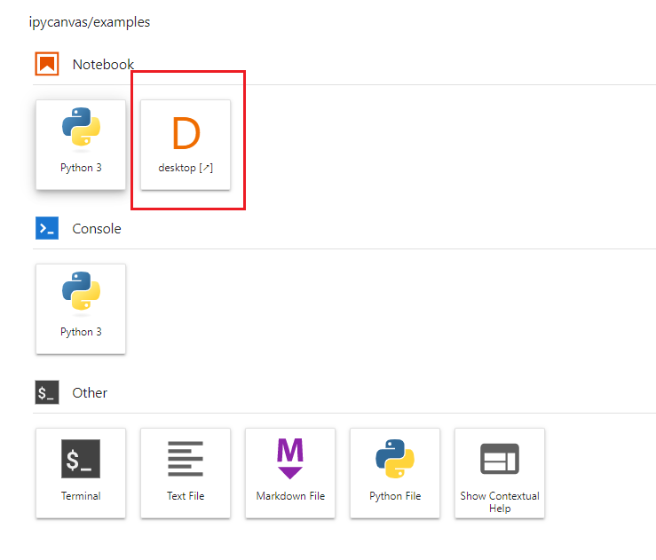

# Google Cloud Medical Imaging Lab Installation Instruction

## 1. Login Into Your Google Cloud Project ##
Using a browser, navigate to https://https://console.cloud.google.com/

## 2. Create a Vertex AI Workbench Instance for the Medical Imaging Lab
These directions are for creating a Vertex AI Workbench instance with the recommended configuration, including a GPU. It is possible to run the lab with smaller machines which a are less costly. Due to the large number of additional packages installed, the boot disk should have at least 100G. You should use an additional disk for data. The use of a GPU is recommended for running AI applications, but it not a pre-requisite. It is possible to change the VM configuration after it is created to add or reduce CPU, memory, GPUs, disk sizes, etc...

To create a VM with the recommended configuration follow these steps:

1. In Navigation Menu select **Vertex AI** > **Workbench**.
2. Click "Enable the Notebooks API" button if needed
3. Click **User-managed notebooks** and then click **New notebook** then **Customize**
4. In **Properties** enter the **Notebook Name** as **medical-imaging**.
5. For **Region** and **Zone** select **us-west1**. (or any other region, you should co-locate the VM with the GCS storage buckets you plan to use)
6. Click the **Environment** bullet, leave the default "Operating System" unchanged (Debian 10)
7. Under "Environment" Click **Pytorch 1.13** 
6. Click**Machine Configuration**, select the recommended type **n1-standard-16** and "GPU Type" as **NVIDIA T4**
    * The use of GPUs is optional but recommended
7. Check the box **Install NVIDIA GPU driver automatically for me**. 
8. Click **Create**.
10. Wait for the **Open JupyterLab** link to open in the list of notebook instances. 
11. Click **Open JupyterLab**. You will be brought to the Jupyterlab instance home screen. 
12. The first time Jupyter opens it launches a dialog informing that Beatrix did not build correclty. This is fine, click "Cancel"

## 3. Clone the Google Medical Imaging Suite Repository
1. In the Jupyterlab Menu, click **Git** > **Clone a Repository**
2. In the repo dialog, enter the Medical Imaging Suite URL: https://github.com/novmarcos/medical-image-lab.git

## 4. Install the Google Medical Imaging Lab environment
1. In Jupyerlab, Click on the Folder icon in the left bar
2. Click on the "+" sign next to the Folder icon to open a Jupyter Launcher tab
3. Open a Jupyter Terminal Window by selecting "Terminal" in the "Other" section
4. In the new terminal window, CD to the installation directory and run the installation script:

    chmod u+x ~/medical-image-lab/install
    chmod u+x ~/medical-image-lab/scripts  
    cd ~/medical-image-lab/install
    ./install_lab.sh

    
## 5. Wait for installation and restart the Jupyter Lab process

The installation fecthes several packages and can take some time, approximately 20 mins. You can monitor the installation progress by periodically checking the contents of the `/tmp/slicer-post-install.log` file

1. Click **Terminal** to open a terminal shell. 

2. Run the following command in the shell to check the progress of the 3D Slicer installation.

    cat /tmp/slicer-post-install.log

When the script has completed you will see the following lines

    #####  install additional packages in the slicer environment ####

    ########################################
    ##### Post Startup Script Complete #####
    ########################################

Once the Google Medical Imaging Lab components have been installed you need to restart the JupyterLab process and refresh the page. 

3. Restart the Jupyter process to pick up the changes. Find the process nuber using the command below: 

    kill -9 $(ps aux | grep '[j]upyter-lab' | awk '{print $2}')

**Note :** This will instantly close your Terminal tab.

4. Refresh the JupyterLab page using the Browser refresh button. This may take a few seconds to restart. 

6. Open a new JupyterLab tab inside the Jupyterlab UI to open the Launcher view. You should now see the **Desktop** icon. 

If you don't see the Desktop icon - restart your notebook instance from the Vertex AI Workbench page and reconnect to JupyterLab. 

